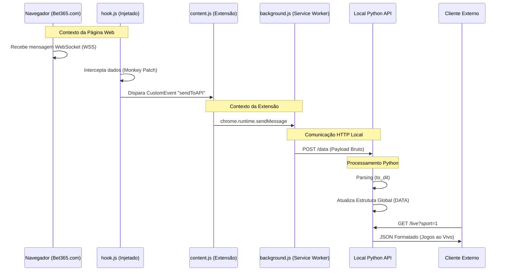

# Arquitetura do Sistema - Bet365 Live Scraper

## Visão Geral
Este projeto é um sistema de _scraping_ em tempo real que intercepta dados de WebSocket do site da Bet365 e os disponibiliza através de uma API HTTP local. O sistema remove a complexidade de autenticação e criptografia do WebSocket original utilizando uma estratégia de "Browser-in-the-Middle".

## Diagrama de Arquitetura



## Componentes

### 1. Extensão do Chrome
Responsável por interceptar os dados brutos.

- **`hook.js`**:
    - **Função**: Injeção de código (Monkey Patching) no protótipo do WebSocket da Bet365 (`window.readit.WebsocketTransportMethod`).
    - **Ação**: Captura cada frame de dados recebido pelo socket e dispara um evento DOM local.
    - **Localização**: Contexto da página (dá acesso aos objetos JS da Bet365).

- **`content.js`**:
    - **Função**: Ponte entre o DOM da página e o isolamento da extensão.
    - **Ação**: Ouve o evento DOM disparado pelo `hook.js` e repassa a mensagem para o Background Script.

- **`background.js`**:
    - **Função**: Service Worker da extensão.
    - **Ação**: Recebe a mensagem do `content.js`, recupera a URL da API configurada e faz um `POST` HTTP para o servidor local Python.
    - **Configuração**: Gerencia a persistência da URL da API (padrão: `http://127.0.0.1:8485/data`).

### 2. API Local (Python/Flask)
Responsável por processar, estruturar e servir os dados.

- **Servidor Flask**:
    - Roda em `http://0.0.0.0:8485`.
    - Endpoint `POST /data`: Recebe o fluxo bruto.
    - Endpoint `GET /live`: Serve os dados processados e limpos.

- **Motor de Parsing (`local_api.py`)**:
    - **`to_dit(txt)`**: Converte o formato proprietário da Bet365 (`k=v;k2=v2;`) em dicionários Python.
    - **`data_parse(txt)`**: Analisa o tipo de mensagem:
        - `\x14` (Initial Dump): Reinicia a base de dados.
        - `\x15` (Update): Aplica diffs (Insert/Update/Delete) nos dados existentes.
        - `MA/PA` (Markets/Participants): Identifica odds e mercados de apostas.

- **Estrutura de Dados em Memória**:
    - Mantém um estado espelhado (`DATA`) do que está acontecendo no browser.
    - Separa eventos por esporte (Futebol `C1A`, Basquete `C18A`) e por região (Sufixos `_10_0`, `_1_3`, etc.).

## Estrutura de Dados Interna
O sistema mantém dicionários globais atualizados em tempo real:

```python
DATA = {
    "C1A_1_3": ["ID_EVENTO_1", "ID_EVENTO_2"], # Lista de IDs de Futebol
    "EV123456...": {                           # Dados detalhados do evento
        "NA": "Time A v Time B",
        "SS": "1-0",
        "TM": "45",
        ...
    }
}
```

## Fluxo de Uso
1. **Iniciar API**: Rodar `local_api.py`.
2. **Abrir Navegador**: Acessar a página `In-Play` (Ao Vivo) da Bet365.
3. **Interceptação**: A extensão injeta o hook e começa a enviar dados para a API.
4. **Consumo**: Scripts externos consultam `http://localhost:8485/live?sport=1` para obter dados sanitizados.
